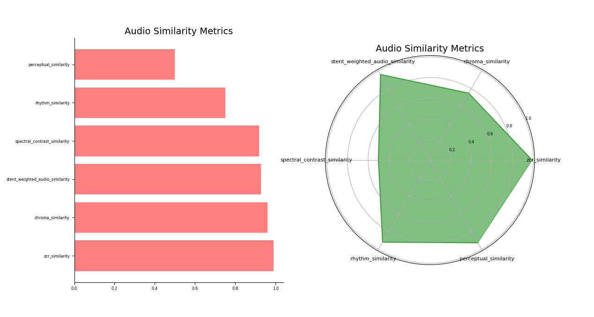

## Experimental Results
### Manual Analysis
Initially, we created a Python script to align audio recordings using a threshold and then perform individual comparisons. We captured the output of our board and contrasted it with both the original audio file and another file sourced from the same audio interface, played from a computer. The script visually represented both the input and output aligned WAV samples for qualitative analysis, showing significant visual similarities. An example of this is shown in the below figure, where the similarity of the shape of the audio files is clearly apparent. The output of the custom board is shown in the bottom graph.

For quantitative analysis, our script analyzed each aligned sample individually to ensure it fell within a ±5% range of the original. However, despite numerous revisions, various error margin adjustments, and even manual sample alignment, discrepancies in the circuitry and DAC performance of our board posed significant challenges. It became increasingly apparent that the one-on-one comparison approach was insufficient. Our algorithm could only achieve a maximum similarity of 35%, which did not accurately reflect the perceptible and visual resemblance in sound. After discussion with Professor Schirner, the it became clear that individual sample comparison would not work due to the aforementioned hardware differences. Instead, more complex algorithms assessing overall sample shapes and frequency responses would be needed for accurate quantitative analysis.

## API Analysis

After conducting research, we discovered the [Audio Similarity](https://github.com/markstent/audio-similarity/tree/main?tab=readme-ov-file#rhythm-similarity) GitHub repository, which offers a comprehensive analysis of audio file similarity using a variety of algorithms. This repository provides a Python API capable of assessing similarities across different audio characteristics, including zero crossing rate (ZCR), rhythm, chroma, spectral contrast, and perceptual attributes. By allowing users to assign custom weights, the API calculates a combined metric known as stent weighted audio similarity, reflecting the overall likeness between two audio files.

Employing this API with a reduced emphasis on perceptual similarity, as it focused specifically on speech signal quality and intelligibility, we obtained a stent weighted audio similarity score of 0.9267 or 92.67% between the original audio file and the one output from our board. The API-generated graph below illustrates the various metrics.

As depicted in the figure, all similarity metrics, except for rhythm and perceptual similarity exceed 90%. This suggests that the output from our custom board accurately reproduces the signal. Furthermore, when comparing the board's output to the audio file recorded from a computer, both of which were recorded through the same audio interface, the API yields a stent weighted audio similarity of 0.9499 or 94.99%. Another graph, generated by the API, showcases these metrics.

As evident from the figure, when employing the same audio interface for recording, all similarity metrics, except for perceptual similarity, surpass the 90% threshold. These results offer solid quantitative evidence supporting the accuracy of our custom board's output. Although influenced by varying hardware topology and minor noise, the output remains highly similar to the original sample.

Overall, our initial manual analysis revealed limitations in accurately comparing audio samples due to hardware disparities. Subsequent exploration led us to the Audio Similarity GitHub repository, offering a more sophisticated approach. By leveraging its Python API, we achieved results indicating strong similarity between our custom board's output and the original audio samples, from 92.67 - 94.99% similarity. These findings show that the firmware and hardware on the custom board can accurately reproduce audio samples.

