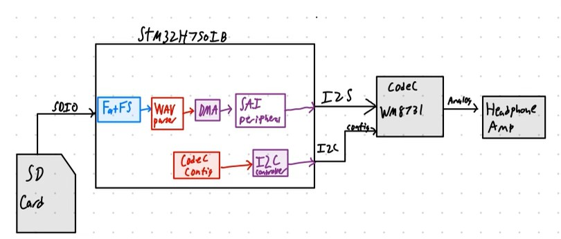

# Project BOOMBA: Embedded Audio Player On FreeRTOS-based System

## Description
The project involves bootstrapping a FreeRTOS-based audio streaming system on an STM32 development board, which includes the utilization of an audio codec, SD card reader and SD card, STM32 microprocessor, H7 DMA modules, and a headphone amplifier. 

The system architecture utilizes an SD card which interfaces with the STM32 MCU through SDIO. A FATFS file system will be implemented for SD card file access. The MCU will host a .WAV parser responsible for interpreting the header and audio data of the .WAV file from the SD card, transforming it into audio words for playback. This parsed data will then be sent to the codec through a DMA FIFO.

Using SAI, (which is I2S-compatible), communication between the STM32 and the DMA will be established. The DMA will act as a FIFO, and will buffer the samples to be sent to the codec. The codec is connected to the STM32 I2C, which will be used for configuration. 

The primary objective is to parse a .WAV file stored on an SD card and play it through the headphone output. Achieving this involves sending .WAV data from the SD card to the MCU, processing that data and sending it to the DMA FIFO, and then processing that data in the codec. Additionally, if there is time, there is a stretch goal that will involve implementing a user interface with buttons and an OLED screen for enhanced user interaction.

## System diagram

## Team Members And Responsibilities 

### Katherine Cloutier: Parsing wave

1. Research WAV File Format
- look at past labs that delt with this
- find resources and documentation that may be helful
2. Design WAV File Header Structure
- define a data struct for WAV file
3. Validate WAV File Integrity
- validation checks to ensure the WAV file is intact and valid
4. Implement Header Parsing Function
- create a function to parse the header of a WAV file
5. Extract Audio Format Information
- extract audio format details from the WAV file header
6. Get Sample Rate and Bit Depth
- extract sample rate and bit depth information from the WAV file header
7. Handle Stereo and Mono Format
- compatibility with both stereo and mono audio formats
8. Implement Error Handling for WAV Parsing
- error conditions and implement error handling
9. Buffer Management for Audio Data
- storing audio data read from the WAV file
10. Handle Endianness and Data Alignment
- big endian and little endian endianness and data alignment in the WAV file
11. Integrate Parsing with Audio Playback
- parsing with audio playback functionality

### Christian Bender: DMA FIFO Management

Tasks will involve setting up an H7 DMA (Direct Memory Access) as a FIFO (First-In-First-Out) to manage audio samples for the SAI (Serial Audio Interface) FIFO. The DMA will receive buffered .WAV samples processed by the STM32. The DMA FIFO, configured as a larger storage buffer (likely 512-1024 samples), will feed data to the SAI audio 8-word FIFO, which will subsequently output to the audio codec.

To achieve this, reference documentation for the STM32H7 series will be used, such as the resource manual available [here](https://www.st.com/resource/en/reference_manual/dm00314099-stm32h742-stm32h743-753-and-stm32h750-value-line-advanced-arm-based-32-bit-mcus-stmicroelectronics.pdf). The DMA will serve as a bridge between the STM32-processed audio samples and the SAI interface FIFO.

Key steps include initializing the DMA to function as a FIFO, establishing communication between the larger DMA FIFO and the SAI audio 8-word FIFO, and getting input samples from the STM37.

This task is a crucial element in the overall project, enabling the smooth flow of audio data through the system. The codec and Christian's work will rely on the successful buffering of samples, and I will rely on the STM32 parsing for audio sample filling.

### Christian Cole

### Noah Mitchell

<!-- ## Description 
Bootstrap a FreeRTOS based system on an STM32 dev board with an audio
codec, SD card reader, and headphone amplifier. Port WAV parser/player, and write drivers for
codec (I2S) and headphone driver
## End goal: parse a .WAV file off of the SD card on the system and play it over the headphone out
## Stretch goal: UI with buttons and the OLED screen!

- Bootstrap a FreeRTOS based system on an STM32 dev board with an audio
codec, SD card reader, and headphone amplifier. Port WAV parser/player, and write drivers for
codec (I2S) and headphone driver
- end goal: parse a .WAV file off of the SD card on the system and play it over the headphone out
- Stretch goal: UI with buttons and the OLED screen!
- SD card with an SDIO interface to MCU
    - FS interface is FATFS
- On MCU, wav parser that takes in a file pointer to a wav file on the SD card
    - Parses header and audio data into audio words
- Codec and STM32 i2C interface for codec configuration
- SAI (which is i2s compatible) interface between STM32 and Codec, with a DMA in the middle that acts as a FIFO
    - Setup the DMA as a FIFO
- Output the audio to a headphone out

## Work involved: 
 -->
