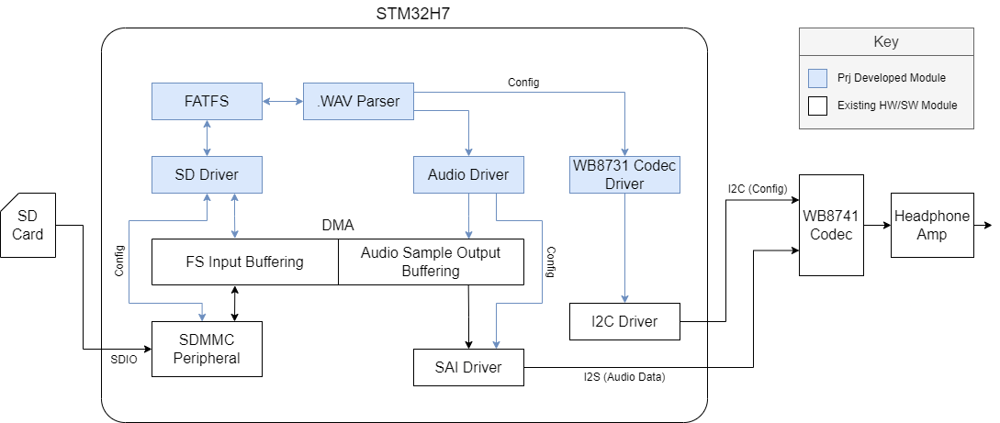

# Embedded Audio Player on FreeRTOS Based System

## Abstract
What, what, status.
What is the objective in this lab? Describe the lab technical aspects, show its aim and the main
findings.

## Intro
Briefly outline the area your project applies to.
Highlight what is missing in current approaches.
Define the problem you want to solve and why it's important.

## Related Work
Highlight similar approaches.
What is the reason for our new implementation?

## Top Level Design Overview
The project involves bootstrapping a FreeRTOS-based audio streaming system on an STM32 development board, which includes the utilization of an audio codec, SD card reader and SD card, STM32 microprocessor, H7 DMA modules, and a headphone amplifier. 

The system architecture utilizes an SD card which interfaces with the STM32 MCU through SDIO. A FATFS file system will be implemented for SD card file access. The MCU will host a .WAV parser responsible for interpreting the header and audio data of the .WAV file from the SD card, transforming it into audio words for playback. This parsed data will then be sent to the codec through a DMA FIFO and an SAI peripheral.

Using the STM32 Serial Audio Interface (SAI) peripheral, (which is I2S-compatible), communication between the STM32 and the codec will be established. An internal DMA channel will act as a FIFO, and will buffer the samples to be sent to the codec. The codec is also connected to the STM32 via I2C, which will be used for configuration. 

The primary objective is to parse a .WAV file stored on an SD card and play it through the headphone output. Achieving this involves sending .WAV data from the SD card to the MCU, processing that data and sending it to the DMA FIFO, and then sending that data to the codec over SAI/I2S. Additionally, if there is time, there is a stretch goal that will involve implementing a user interface with buttons and an OLED screen for enhanced user interaction.

A system diagram that highlights the interaction between these different components is shown in the below system diagram.

## Contributions
Who did what with links to where you can find the design documentation for each component.

@dduuukk (Christian Bender) was responsible for completing the audio driver. The design, implementation, and operation of the audio driver is discussed in more detail [here](src/drivers/sai-design.md).

## Implementation Progress
Assess our goals in the project, were our goals met? Where did we fall short?

## Future Work
What comes next?
