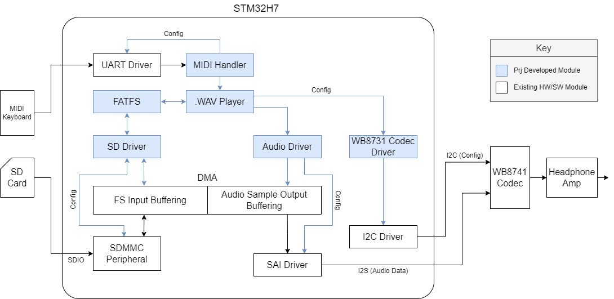

# Embedded Audio Sample Player with MIDI Support

## Abstract

This project involves the development of a bare-metal audio sample player with MIDI support on an STM32H7 development board. The primary objective is to parse and play .WAV files stored on the SD card when a MIDI keypress is recieved. Currently the system successfully parses MIDI messages, reads .wav files off of the SD card, and streams audio through the codec to a line out and a headphone out. We successfully minimized latency, with imperceptible delay between keypress and sample start, and achieved a 95% similarity index between our hardware output and the expected output (with the minimal differences likely being a product of D/A conversion rather than any implementation error)

## Intro
Briefly outline the area your project applies to.
Highlight what is missing in current approaches.
Define the problem you want to solve and why it's important.

The project delves into the realm of bare-metal embedded systems, focusing specifically on the development of an audio sample player system using an STM32H7 development board, the Electrosmith Daisy, and our own custom PCB. In embedded systems, integrating audio streaming capabilities poses significant challenges, especially concerning resource utilization, latency, and system complexity.

This project involves the development of a bare-metal audio sample player with MIDI support on an STM32H7 development board. The system integrates various hardware components, including an audio codec, SD card reader, STM32H750 ARM microprocessor, and UART MIDI interface. The system employs a FATFS file system for interaction with the SD card. A .WAV parser within the STM32 MCU interprets .WAV file headers and audio data from the SD card, facilitating audio playback. Communication between the MCU and the codec is established through the STM32 Serial Audio Interface (SAI) peripheral, utilizing I2S compatibility. Additionally, an I2C connection configures the codec. The primary objective is to parse and play .WAV files stored on the SD card when a MIDI keypress is recieved.

This is a problem solved by many other samplers, such as the Teenage Engineering EP-133, and various software solutions, but our goal was to use this project to bootstrap our custom hardware.

## Related Work
In exploring related work for our project, several notable efforts in audio streaming and sampling on the Daisy and STM32H7 platforms were found. 

Firstly, the [Daisy Library](https://github.com/electro-smith/libDaisy) stands out, offering drivers which enable various audio processes on the Daisy development board, such as audio file streaming and MIDI parsing. We used this library as reference during the development of our code.

Other software solutions exist that also resemble our board's functionality. For instance, Daisy offers a [.WAV player](https://github.com/electro-smith/DaisyExamples/blob/master/seed/WavPlayer/WavPlayer.cpp) that, similar to our implementation, streams audio files from an SD card. Additionally, [Daisy-based MIDI controllers](https://github.com/heavyweight87/MidiController) exist, though primarily designed for other purposes such as guitar pedals, provide similar functionality in terms of parsing MIDI data.

Likewise, there are many hardware solutions that exist that similarly resemble our system's functionality. For example, the [Roland SP-404](https://www.roland.com/us/products/sp-404/) and the [Teenage Engineering EP-133](https://teenage.engineering/products/ep-133) are two commercial products that offer audio sample playback and MIDI capabilities, as well as a variety of other features.

Our implementation serves two primary purposes. Firstly, it sets the stage for a future soft synth project on the Daisy board, laying essential groundwork and drivers for future development. By bypassing the Daisy library, we gain finer control over development and ensure compatibility with custom hardware, enabling greater efficiency and integration. Secondly, this is a personal project, and was fun to complete.

## Top Level Design Overview
This project involved bootstrapping an audio streaming system on an STM32 development board, which includes the utilization of an audio codec, SD card reader and SD card, STM32 microprocessor, H7 DMA modules, MIDI, and a headphone amplifier. 

The system architecture utilizes an SD card which interfaces with the STM32 MCU through SDIO. A FATFS file system has been implemented for SD card file access. The MCU hosts a .WAV parser responsible for interpreting the header and audio data of the .WAV file from the SD card, transforming it into audio words for playback. This parsed data is then be sent to the codec through a DMA FIFO and an SAI peripheral.

Using the STM32 Serial Audio Interface (SAI) peripheral, (which is I2S-compatible), communication between the STM32 and the codec is established. An internal DMA channel acts as a FIFO, and buffers the samples to be sent to the codec. The codec is also connected to the STM32 via I2C, which is used for configuration. 

To allow an external controller to interface with out system, a MIDI handler has been implemented to translate incoming MIDI over UART data into usable information. The driver handles the reception and storage of UART data, parsing of data into MIDI events, and providing stored MIDI events as needed by the system. This allows for the loading and playing of different .WAV files stored on the SD card upon button press.

The primary objective is to parse a .WAV file stored on an SD card and play it through the headphone output, using MIDI to control the sounds played. Achieving this involves triggering playing using MIDI, sending .WAV data from the SD card to the MCU, processing that data and sending it to the DMA FIFO, and then sending that data to the codec over SAI/I2S.

A system diagram that highlights the interaction between these different components is shown in the below system diagram.

## Contributions
Who did what with links to where you can find the design documentation for each component.

@dduuukk (Christian Bender) was responsible for completing the audio driver. The design, implementation, and operation of the audio driver is discussed in more detail [here](docs/sai-audio-driver/sai-design.md).

@nmitchell02 (Noah Mitchell) implemented the SDMMC driver, block driver, and FatFS interfaces, explained [here](docs/sd-fs-driver/sd-fs-design.md) 

Katherine Cloutier implemented the [WAV file parser](src/wav-parser/Readme-wav-parser.md).

Christian Cole (@cole-ch) was responsible for the development of the audio codec driver and the MIDI handler. More information about audio codec driver can be found [here](docs/i2c-codec-driver/i2c-codec-design.md), and more information about the MIDI handler can be found [here](docs/uart-midi-driver/uart-midi-design.md).

## Implementation Progress

Not only did we successfully create a .wav player with an SD card interface on our custom hardware, we reached a stretch goal of enabling MIDI communication, which made our project significantly more engaging to use and rewarding to complete. It was a success!

## Future Work

Currently, our system is bare-metal, which limits how flexible and performant our implementation is. The first step to be taken is to integrate FreeRTOS into our system and split system components into individual tasks, such as the filesystem task, audio streaming task, and user input handler task. This will allow us to suspend the filesystem task while it waits for data to be fully transferred from the SD card, or suspend the audio task while it waits for samples to be transmitted to the codec. These optimizations will both be possible due to the use of DMA controllers, allowing us to perform other useful work while the DMAs are active and the task is waiting on completion.

Beyond that, we intend to implement a SPI driver for our OLED screen, enabling us to create a user interface, and to turn this platform into a full-fledged software synthesizer, occupying a similar market to the Teenage Engineering OP-1 (but without a keyboard).