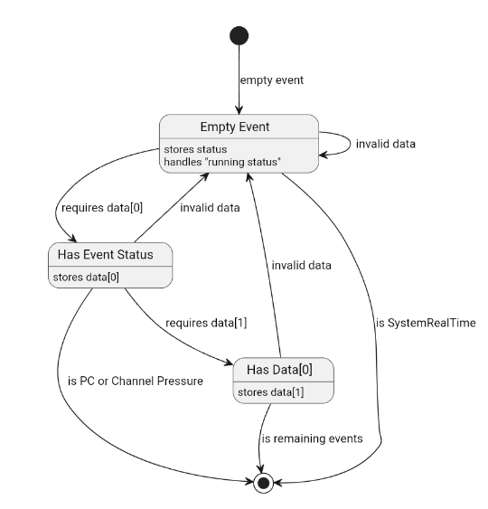

## MIDI Driver Design
### Design
To encourage more musical and generally more interesting usage of the sample player, samples can be triggered and played through the means of some sort of controller. To allow an external controller to interface with out system, we developed a MIDI handler to translate incoming MIDI (UART) data into usable information. This driver handles the reception and storage of UART data, parsing of data into MIDI events, and providing stored MIDI events as needed by the system. The MIDI driver does not explicitly handle the UART peripheral initialization, though it will be mentioned in this report to emcompass the information in one place.


As the system utilizes the codec in "slave mode", where the clocking and SAI/I2S is all handles by the "master" (in our case the STM32), the driver consists of functions that focus on the ability to control the codec over I2C. This includes being able to turn on and off the codec, configure bypass, data formating, and general use functions to make communication easier as the codec does not communicate through a standard I2C protocol(which will be discussed later in the implementation of the driver).

### Implementation
The codec driver is encapsulated within the `WM8731` class, which serves as the central component responsible for configuation of the codec and initialization of the required hardware peripherals hardware. By organizing the driver into a class, the creation of a codec driver object and all associated HAL objects is fully encapsulated in and managed by the class, increasing code organization and easing user parsing level interaction. C++ classes offer additional benefits including improved modularity and ease of maintenance.

Upon creation, the `WM8731` initializes all attributes, including device addresses and initial configuartion values for each of the codec's registers. These values are all set in the initialization and are easy to be set to a desired starting configuration based on the users needs, removing the need for manual configuration later. Creation also creates a `I2C_HandleTypeDef` that is then used to initialize the STM32's I2C2 peripheral and will be used for later I2C data transmission. The choice for isolated I2C initialization and usage is due to the Electrosmith Daisy's hardware configuration that only has the codec on the I2C2 peripheral bus and does not have any further access to it.



Post construction, the `WM8731` provides a few public functions to the user. The core to all of them is `registerWrite`, which takes in a driver defined register value and a uint16_t data value to transmit data to the codec over I2C. This is because some of the codec's registers make use of a 9th bit for configuration (usually used to configure both left and right channels at the same time) that is added as the LSB of the first data byte (alongside the register address). The `registerWrite` function allows for easier distinction of the register address and data values, and is used as the underlying transmit function for all other object functions. The rest of the class' functions are used to configure various parameters of the codec. As the codec does not have the ability to have it's registers read, the configuartion functions make use of stored register values that are updated with each function use so that individual controls can be updated without the need of configuring the entire register every time.

### Usage Definition
In order to use the midi driver, an instance of the class must first be created. This can be done by defining a new codec driver class as shown below. 

```c++
WM8731 <codec object name> = WM8731();
```

Once the codec audio driver object has been created, the codec can be configured with the previously initialized values using the `init` function or the `registerWrite` function, like shown below.

```c++
<codec object name>.init();
```

```c++
<codec object name>.registerWrite(uint8_t <register definition>, uint16_t <value>);
```

Providing valid parameters to `registerWrite` (and any other functions that require similar data) can be easily done by using the value definitions provided at the top of the driver's header function. An example is shown below.

```c++
<codec object name>.registerWrite(REG_SAMPLING_CTRL, SAMPLE_MODE_NORM | BOSR_NORM | ADC_48k_DAC_48k);
```

Likewise, the codec can be easily enabled, disabled, and reset using the corresponding functions. The driver also has some specialty function implemented to configure important parameters, like sample rate. The function is called similarly to the `registerWrite` function, but does not require a specific register definition as it is built into the function. For example, a sample of the `configureSampleRate` fuction is shown below.

```c++
<codec object name>.configureSampleRate(ADC_44k1_DAC_44k1);
```
