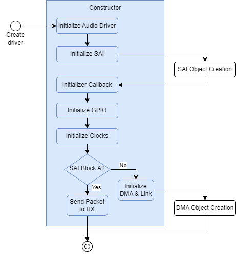
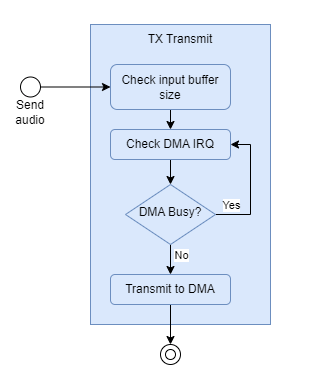
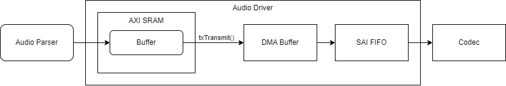
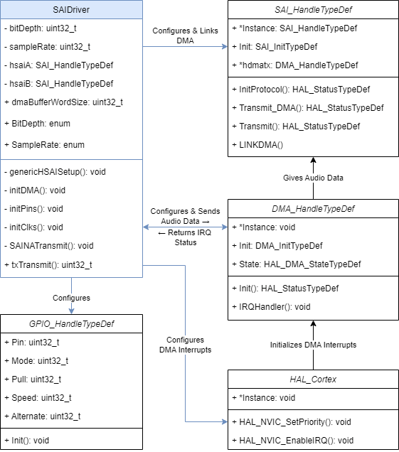

## Audio Driver Design
### Design
The audio driver is a crucial component for audio streaming in the system, as it facilitates the transmission of user-parsed .WAV data to the Audio CODEC for audio playback. This driver does this using the Hardware Abstraction Layer (HAL) library, the high-performance H7 DMA (Direct Memory Access), and the Serial Audio Interface (SAI) FIFO.

The driver has two main functionalities: the initialization of all HAL objects and the management and transferring of buffered and parsed audio data to the DMA. During initialization, the driver uses the HAL library to initialize Block A (RX) and B (TX) of the SAI FIFO with the desired user bit depth and sample rate. It automatically starts the SAI FIFO *MCLK* and initializes and links the DMA to the TX SAI FIFO. While originally, only one block of SAI FIFO was wanted as no RX operations are expected for this board, through experimentation it was determined that the Daisy devboard relies on the initialization of the RX block to start the *MCLK*, which is needed to send any audio data. While the RX block is not being used at the moment, this design adds the benefit of being able to expand the board to handle microphones and other inputs in the future. The below diagram covers the high-level initialization operation of the audio driver.

When the user requests a transfer, the driver transfers the data to a dedicated DMA queue, from which the SAI FIFO autonomously retrieves samples. The driver polls the DMA interrupt status to make sure the DMA is not busy when the transmission is requested, and will block until the DMA is ready. This functionality was originally designed to block the thread, but not wait the entire CPU. However, due to timing constraints, FreeRTOS was not successfully integrated into the system, and thus the polling method had to be used. While less efficient than thread sleeping and waking on interrupt, the large input buffer sizes (256KB) gives long periods between any polling needs to be performed, giving the CPU more free time. Once transferred, the SAI FIFO Block B requests these samples from the DMA, and sends them to the CODEC for interpretation. 

The designed data flow to get audio from the user level to the codec is highlighted below.

The decision to incorporate DMA into the audio driver architecture stems from the desire to enable asynchronous streaming capabilities. Technically, it is possible to send audio data directly to the SAI FIFO for each block, but the SAI FIFO only has an 8 sample depth, and thus the CPU would constantly need to feed the FIFO to keep it from running empty, which would apply to any buffer size. By offloading the data transfer task from the CPU to dedicated DMA channels, we alleviate CPU stress and unlock the capability for larger input sample buffer sizes. This not only enhances the efficiency of data transmission but also ensures smoother audio playback and less overall CPU utilization.

### Implementation
The audio driver is encapsulated within the `SAIDriver` class, which serves as the central component responsible for managing audio data transmission and interaction with the hardware components. By organizing the driver into a class, the creation of an audio driver object and all associated HAL objects is fully encapsulated in and managed by the class, increasing code organization and easing user parsing level interaction. C++ classes offer additional benefits including improved modularity and ease of maintenance, which is important as @nmitchell02 and @cole-ch are going to continue development on the project after the course is over, and must be able to easily add to and maintain the driver without contact with the original author.

The audio driver class design and interaction with HAL classes is highlighted in the diagram below. Any class or association in blue represents a project developed class or interaction.

The class diagram highlights the resources that the driver initializes, and the API available to the user. Upon creation, the `SAIDriver` initializes and creates two `SAI_HandleTypeDef` objects based on the desired bit depth and sample rate which are stored in `SAI_HandleTypeDef.init`, one for SAI Block A and another for Block B. The `SAIDriver` also initializes any necessary clocks, creates a `GPIO_HandleTypeDef` object to initialize the STM32 pins for SAI transfer, and the constructor sends a garbage packet after successful creation to Block A (which is set up as RX) directly to the SAI FIFO to start the SAI *MCLK*, which then allows transferring over Block B. The DMA is linked to Block B TX using the `LINKDMA()` macro, where the `SAI_HandleTypeDef` object stores a pointer to the DMA in `*hdmatx`, and can use this to automatically pull samples from the DMA. For Block B, the initializer also uses `HAL_Cortex` to initialize DMA interrupts. All of the interrupts are handled inside of the SAIDriver.

Post construction, the `SAIDriver` only provides a single public function to the user, `txTransmit`, which allows the user to transmit audio data through the data pipeline into the CODEC for output. While it's simple to change the sample rate and bit depth of the SAI FIFO on the fly, it was not recommended to do the same for the CODEC in the documentation. Thus, the SAI sample rate and bit depth are setup once in the Audio driver, and changing sample rate or bit depth on the fly was implemented in the audio parser. The transmit function ensures that the buffer size input is not too large, and waits for DMA to not be busy by polling the interrupt state `hsaiB.hdmatx->State == HAL_DMA_STATE_BUSY` if necessary. If all checks pass, the data is passed to the DMA using `HAL_SAI_Transmit_DMA`.

As a result of all design decisions, this implementation is a driver that includes error checking, built in blocking on transmission, and a class structure that allows for an easier user-level experience while providing future modularity.

### Usage Example
